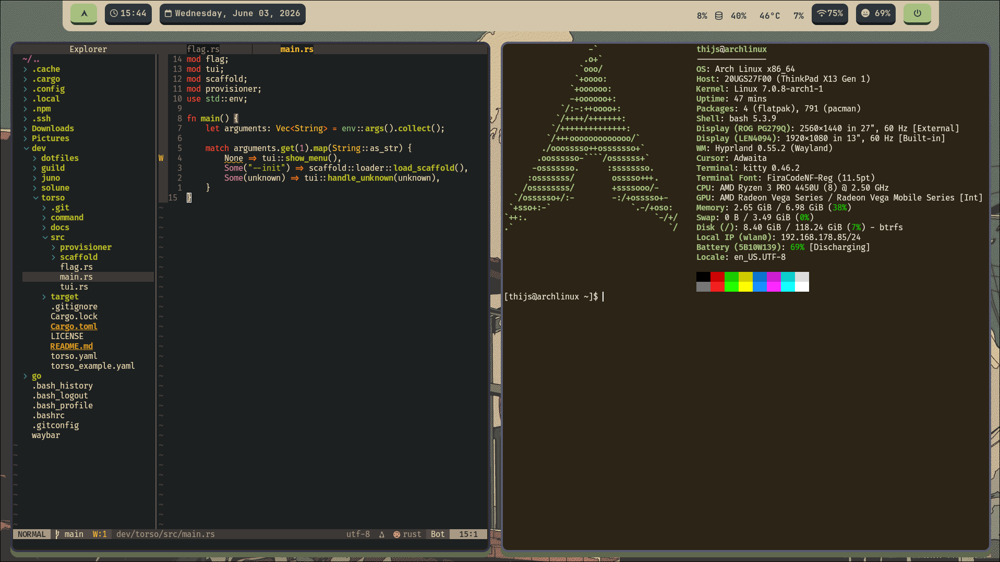

# Hyprland Dotfiles

My personal Hyprland configuration for Arch Linux, including window manager setup, Waybar, wallpaper handling, and essential desktop utilities.

---

## Example 

<table>
  <tr>
    <td></td>
    <td></td>
  </tr>
</table>

## Hyprland Dotfiles Dependencies

### Core Desktop
- hyprland
- awww

### Applications
- kitty
- wofi
- waybar

---

## Notes
- Ensure all dependencies are installed before starting Hyprland
- Some configs may reference ~/Pictures/wallpapers
- If something does not work, verify paths in ~/.config/hypr/hyprland.conf
